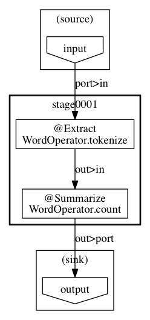

# Asakusa WordCount Example

[Hadoop WordCount](https://hadoop.apache.org/docs/current/hadoop-mapreduce-client/hadoop-mapreduce-client-core/MapReduceTutorial.html#Example:_WordCount_v1.0), [Spark WordCount](http://spark.apache.org/examples.html) と同様のWord CountをAsakusa Frameworkで実装したものです。

## 処理概要

入力データを [DirectIO line](http://docs.asakusafw.com/0.7.5/release/ja/html/sandbox/directio-line.html) で読み込み、 [@Extract](http://docs.asakusafw.com/latest/release/ja/html/dsl/operators.html#extract-operator) で単語に分解し、 [@Summarize](http://docs.asakusafw.com/latest/release/ja/html/dsl/operators.html#summarize-operator) で集計しています。

## テスト

演算子の単体テストと、ジョブフローのテストを実装しています。
テストの詳細については、 [ユーザーガイド](http://docs.asakusafw.com/latest/release/ja/html/testing/start-guide.html) をご覧ください。
